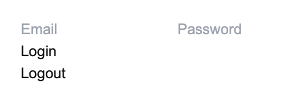
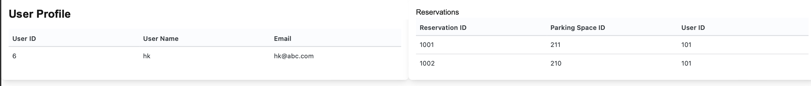

This is a branch of master `park-easy-frontend` to implement parking history for one user.
User infroamtion can be fetched from database , reservations are informed by REST API.

### Flow of logic

!!UWAGA!!
The src is intended to match the functional requirements such as displaying reservation history(including reservation ID, parkingSpaceID) with user inforamtion (user name, email address).

1. It should implement `server` and `client` componets
2. By `getAll` function on backend controller, reservation information can be transformed.
3. By `member/login` , the loggined user should get the user information
   3.1 To get the user information, it should be authenticated and generate session.
   3.2 After feteching the user information, it should be stored on cookies.
   3.3 The program will use the cookies to rendering the page.

### Example of rendering

1. First required user login 
2. Rendering the user information with reservation history.
   
